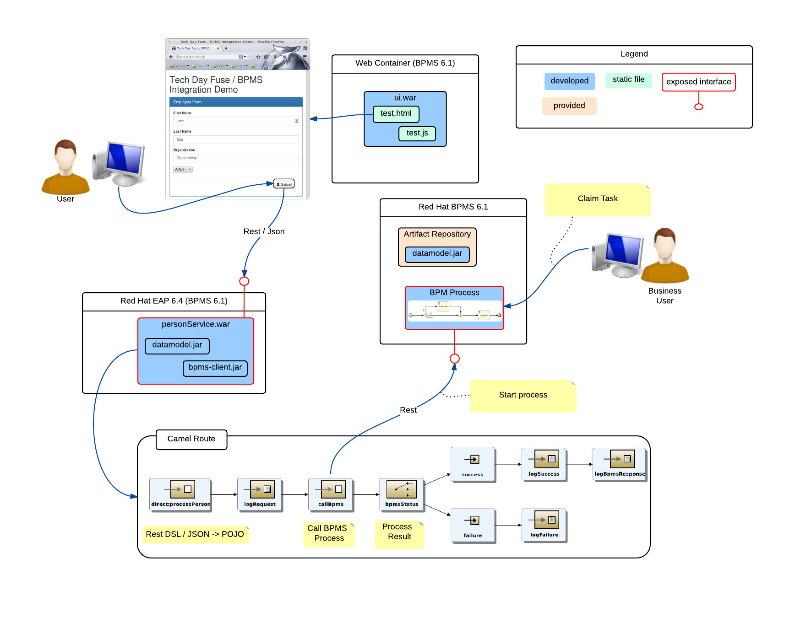

# Red Hat Tech Day Fuse BPMS Integration Demo

## Architecture

## Sub Projects
### bpms
This folder contains a completed BPMS process that can be uploaded to business central. It also contains a lab ([bpms/README.md](../bpms/README.md)) describing how to create the BPM Process for the workshop.
### bpmsclient
This maven project implements a custom camel component that can be used to call BPMS processes.
### datamodel
This maven project implements a datamodel, consisting of a single Person class.  A person has a first name, last name, organizaton and an active boolean attribute.
### personservice
This maven project implements a camel route, exposed as a restful service. The route takes in a person object (as json) and starts a process on BPMS, passing it the object. It has a dependency on the datamodel project (for the Person class) and the bpmsclient project, which it uses to call the BPMS process.
### ui
This maven project implements a simple user interface that can be used to call the personservice.
