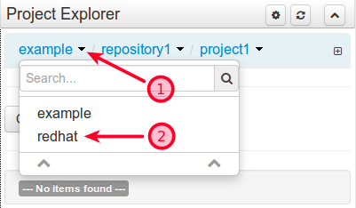
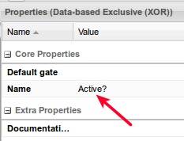
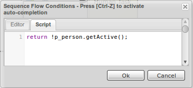
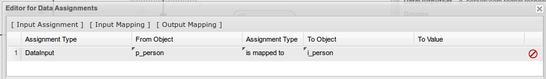

# Creating the BPMS process in Business Central

## Create a New Repository
 1. Login to Business Central (http://localhost:8080/business-central)
 2. Select **Authoring** -> **Administration**
 3. Select **Organizational Units** -> **Manage Organizational Units**
 4. Click the **Add** button
 5. Fill out the form as below and click **ok**

  

 6. Select **Repositories** -> **New Repository**
 7. Fill out the form as below and click **Finish**

  

## Create a new BPMS project
 1. Select **Authoring**->**Project Authoring**
 2. Under **Project Explorer** click the down arrow next to ***example*** to change organizational unit to **redhat**:

 

 The techday repository should now be selected as well.

 3. Select **New Item** -> **Project** and set the project name to **project**, select **ok**
 4. Accept the default Group, Artifact and Version, select **Finish**

 

## Upload the datamodel jar file
Our process will use the Person object contained in the maven datamodel project. We will upload it to BPMS to make it available to the process.

1. In JBoss Developer Studio, right click the datamodel folder and select **Run As** -> **Maven install**

2. Verify that the project is successfully built:

        [INFO] ------------------------------------------------------------------------
        [INFO] BUILD SUCCESS
        [INFO] ------------------------------------------------------------------------
        [INFO] Total time: 4.246 s
        [INFO] Finished at: 2015-07-21T12:48:55-05:00
        [INFO] Final Memory: 9M/240M
        [INFO] ------------------------------------------------------------------------

3. In BPMS, select **Authoring** -> **Artifact Repository**, then click **Upload**
4. Select **Choose File** and navigate to the ***target*** folder of the ***datamodel*** project
5. Select the **datamodel.jar** file and click **Open**. Click **Upload** then **OK**

  The datamodel jar should appear in the list of artifacts:

  

## Add the datamodel to the project's dependencies
1. Select **Authoring** -> **Project Authoring**
2. Select the small arrow to the right of **example** and choose **redhat**
 

3. Click the **Open Project Editor** button

  

4. Select **Dependencies** from the drop down list

  

5. Click the ***Add from repository*** button
6. Click the **select** button next to the datamodel jar.
7. Click the **save** button on the upper right of the screen below the search bar

  

## Create the process

Two options are provided below for creating the BPMS process. The first option is to manually create the process. This is the preferred approach as it will give you an introduction to BPMS process authoring. If there is a time constraint, the already completed process (PersonProcess.bpmn2) may be uploaded to business Central.

The process will take as input a Person object. If the active attribute of the person is set to true, then the person is simply logged.  If the active attribute is set to false, then a human task will be started.  The human task will allow a buisiness user to modify the attributes of the person.  Afterwards, the person object will be logged.  The completed task should look similar to the following:

 

### Creating the process from scratch
1. Select **New Item** -> **Business Process**
2. Name the process **PersonProcess** with a package of **com.redhat.techday** and click **Ok**

  You should see a canvas consisting of a single start node

  

3. Click the background of the canvas
4. Click the small chevron in the upper far right of the canvas to reveal the properties display:

  

5. Find the **Variable Definitons** property and click the empty **Value** field next to it
6. Click the down arrow that appears in the value field:

  

7. Click the **Add Variable** button at the top of the dialog

   **Name:** p_person

   **Custom Type:** com.redhat.techday.datamodel.Person

   

8. Click the **Ok** button.
9. Save the process. Continue to save periodically.

  

  Select **Ok** on the comment dialog, or optionally enter a comment.

10. Click the starting node. Click the gateway icon (diamond with an x in it) and drag it to the right:

  

11. Select the Gateway node and modify the name (properties panel on the right) to be ***Active?***

  

12. Click the gateway node. Locate the square node icon:

  

13. Drag the square node icon up and to the right:

  

14. Click the newly created node. Update its properties by giving it a **Name** of ***Human Task**** and a **Task Name** of ***humanTask***. Don't forget to save.
15. Click the arrow going from the gateway to the human task node.  Set the name to ***No***
16. With the arrow still selected, click the empty value field next to the Expression property and click the down arrow.
17. Click the **Script** tab and enter the following java code:

        return !p_person.getActive();

  

18. Click the **Ok** Button
19. Click the chevron in the upper left corner of the canvas to reveal the Object Library:

  

20. Expand **Gateways**. Click **Data-based Exclusive (XOR)** and drag it below the human task node:

  

21. Select the Human Task Node. Select the arrow icon and drag it to the gateway that we just added.

  

22. Select the **isActive** gateway. Select the arrow icon and drag it to the gateway to the right.
23. Set the name of the arrow that we just created to ***Yes***
24. With the arrow still selected, click the empty value field next to the Expression property and click the down arrow.
25. Click the **Script** tab and enter the following java code:

        return p_person.getActive();

26. Click the **Ok** Button
27. Select the Gateway on the right. Click the square node icon and drag it to the right.
28. Set the name of this new node to ***Log Person*** and set the task name to ***logPerson***
29. Hover over the wrench icon below the Log Person node.

  

30. Select **Script Task**
31. On the properties panel, click the empty value field next to the **Script** property, then click the down arrow on the right (similar to step 6)
32. Enter the following java code to log the Person object:

        System.out.println("Processed " + p_person);

33. Click the **Ok** button
34. Select the ***Log Person*** node and find the small circular node icon to the right:

  

35. Drag the icon to the right. This represents the end of the process. Next we will configure the human task.

  

36. Select the ***Human Task*** node
37. Hover over the wrench icon and select **User Task**
38. In the properties tab, set **Actors** to ***bpmsAdmin***. This is the user that can claim the human task.
39. Select the **DataInputSet** property (click the empty value field, click the down arrow). Click **Add Data Input**

  **Name:** i_person

  **Custom Type:** com.redhat.techday.datamodel.Person

40. Click the **Ok** button
41. Select the **DataOutputSet** property (click the empty value field, click the down arrow). Click **Add Data Output**

  **Name:** o_person

  **Custom Type:** com.redhat.techday.datamodel.Person

42. Click the **Ok** button
43. Click the **Assignments** property (click the empty value field, click the down arrow)
44. Click the **[ Input Mapping ]** button at the top of the dialog.
45. Enter the following values:

  

46. Click the **[ Output Mapping ]** button at the top of the dialog.
47. Enter the following values:

  

48. Select the "Generate all forms" option

   

49. Save the project (**Open Project Editor** button, then **save** button)
50. Select **Build & Deploy**

    

### Uploading an existing process

Rather than creating the process from scratch, you can upload a working process that was created in advance:

1. Select **New Item** -> **Uploaded File**
2. Set the **Uploaded File** name to ***PersonProcess.bpmn2***
3. Change the package to ***com.redhat.techday***
4. Select **Choose File** and navigate to bpms/PersonProcess.bpmn2
5. Select **OK**
6. Open the process. It is located under ***src/main/resources/com/redhat/techday***
7. Select the "Generate all forms" option

 

8. Save the project (**Open Project Editor** button, then **save** button)
9. Select **Build & Deploy**

  

## Testing the process
1. Select **Process Management** -> **Process Definitions**
2. Click the start button next to the process

 

3. Fill in the parameters then click **Submit**

  **Note:** by default ***active*** will be set to false, so a human task should be created

4. Select **Tasks** -> **Tasks List**
5. There should be a ***Human Task*** in the list, click it. The parameters you entered should appear
6. In the **Work** tab, click the **Start** button
7. Modify some of the parameters then click the **Complete** button
8. The person details should be logged in the **Console** tab of JBoss Developer Studio (Assuming BPMS was started via JBDS):

        15:31:43,615 INFO  [stdout] (http-localhost/127.0.0.1:8080-3) Processed Person [firstName=Joe, lastName=Doe, active=false, organization=Org]
