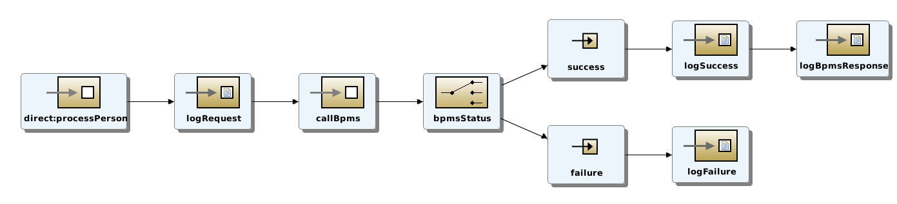

# Person Service
The person service exposes a Rest Service using the Camel DSL. It takes in a Person object (as JSON) and calls a BPMN process (residing on BPMS 6.1), passing it the person object. It also verifies the process was called successfully.

## Camel Route


# Workshop
## Configure the Rest endpoint
This camel route uses a relatively new feature in camel - the Rest DSL.  This allows rest services to be created quickly and easily.  Rest DSL is supported as of Fuse 6.2.

1. in Jboss Developer Studio, open ***personservice/src/main/resources/camel-config.xml*** and select the **Source** tab, at the bottom of the view.

2. Replace

  ```xml
    <rest id="Update_Me"/>
  ```

  with the following:

  ```xml
  <rest path="/update">
    <post consumes="application/json" produces="application/json" type="com.redhat.techday.datamodel.Person">
      <to uri="direct:processPerson"/>
    </post>
  </rest>

  ```

Note that this creates a rest endpoint (/update) that consumes / produces json and expects a Person object as input. It sends the input to the ***processPerson*** camel route.


## Configure the BPMS call
This camel route uses a custom camel component (defined in the bpms-client project) to call the BPMN process on BPMS 6.1. Update the camel route to call the BPMN process properly.

1. Replace
    ```xml
    <to uri="bpms://startProcess" id="Update_Me_Too"/>
    ```

     with the following:

    ```xml

    <to uri="bpms://startProcess?baseUrl=http://localhost:8080/business-central/&amp;deploymentId=com.redhat.techday:project:1.0&amp;username=bpmsAdmin&amp;password=p@ssw0rd&amp;processId=project.PersonProcess&amp;processVarName=p_person" id="callBpms"/>

    ```

2. Update the ***deploymentId, username, password, processId and processVarName*** as necessary.
